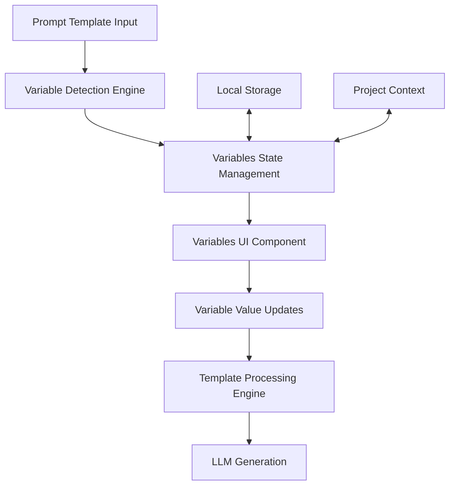
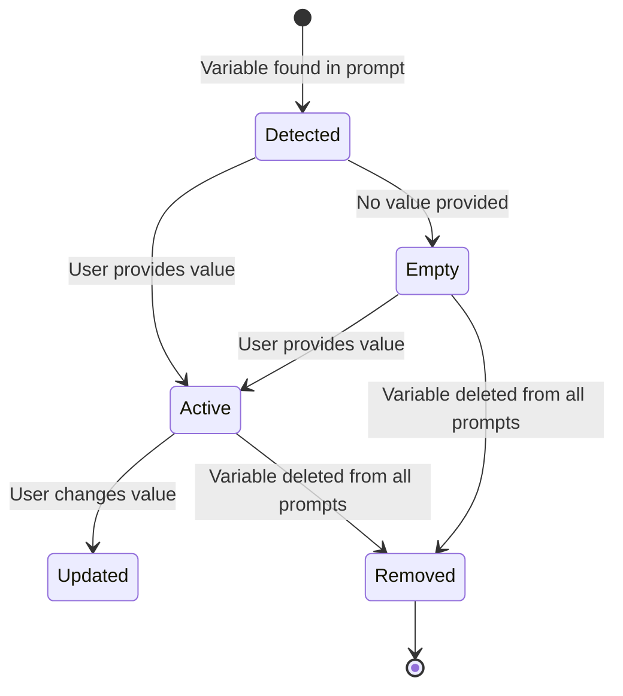

# Design Document

## Overview

The Prompt Variables feature will extend the existing Prompt Forge architecture to support dynamic variable substitution in prompt templates. The feature will integrate seamlessly with the current local-first, version-controlled data model while providing an intuitive UI for variable management.

The implementation will follow the existing patterns in the codebase:
- Local storage persistence through the existing storage layer
- React Context for state management
- Immutable version updates
- Real-time UI updates with proper streaming support

## Architecture

### Data Flow Architecture



### Component Architecture

The feature will integrate with the existing component hierarchy:

```
src/app/page.tsx (Main UI Layout)
├── Left Panel: Prompt Template Section
│   ├── PromptTextarea (Enhanced with variable highlighting)
│   └── Variable Detection Logic
└── Right Panel: Generations Section
    ├── Variables Management Component (New)
    │   ├── Variable List
    │   ├── Variable Input Controls
    │   └── Empty State Display
    └── Existing Generation Controls
```

## Components and Interfaces

### 1. Variable Detection Engine

**Location**: `src/lib/variableUtils.ts`

```typescript
interface DetectedVariable {
  name: string;
  positions: Array<{ start: number; end: number }>;
}

interface VariableDetectionResult {
  variables: DetectedVariable[];
  hasVariables: boolean;
}

// Core detection function
export function detectVariables(content: string): VariableDetectionResult

// Template processing function
export function processTemplate(template: string, variables: Variable[]): string
```

**Functionality**:
- Parse prompt content using regex pattern `/\{\{([^}]+)\}\}/g`
- Extract unique variable names
- Track variable positions for potential highlighting
- Handle edge cases (malformed syntax, nested braces)

### 2. Enhanced Storage Layer

**Location**: `src/lib/storage.ts` (Extended)

The existing `Variable` interface is already defined:
```typescript
export interface Variable {
  name: string;
  value: string;
}
```

**New Functions**:
```typescript
// Update variables in current version
export function updateVariables(project: Project, variables: Variable[]): Project

// Extract variables from all prompts in current version
export function extractVariablesFromPrompts(prompts: Prompt[]): string[]

// Merge detected variables with existing variable values
export function mergeVariables(detected: string[], existing: Variable[]): Variable[]
```

### 3. Variables Management Component

**Location**: `src/components/variables-section.tsx`

```typescript
interface VariablesSectionProps {
  variables: Variable[];
  onVariableUpdate: (name: string, value: string) => void;
  isGenerating?: boolean;
}

export function VariablesSection(props: VariablesSectionProps): JSX.Element
```

**Features**:
- Display detected variables in a clean list format
- Provide textarea inputs for each variable value
- Show empty state when no variables are detected
- Real-time value updates with debouncing
- Proper loading states during generation

### 4. Enhanced Project Context

**Location**: `src/contexts/ProjectContext.tsx` (Extended)

**New Context Methods**:
```typescript
interface ProjectContextType {
  // ... existing methods
  updateVariable: (projectUid: string, name: string, value: string) => void;
  getDetectedVariables: (projectUid: string) => string[];
  processPromptsWithVariables: (projectUid: string) => Prompt[];
}
```

### 5. Enhanced Prompt Textarea

**Location**: `src/components/prompt-textarea.tsx` (Enhanced)

**New Features**:
- Visual highlighting of `{{variable}}` syntax
- Optional tooltip showing variable values on hover
- Syntax validation feedback

## Data Models

### Variable State Management

Variables will be stored in the existing `VersionData.variables` array and managed through the Project Context. The data flow will be:

1. **Detection Phase**: Scan all prompts in current version for `{{variable}}` patterns
2. **Synchronization Phase**: Merge detected variables with existing variable values
3. **Storage Phase**: Update version data with merged variables
4. **Processing Phase**: Replace variables with values during LLM generation

### Variable Lifecycle



## Error Handling

### Variable Detection Errors
- **Malformed Syntax**: Handle incomplete `{{` or `}}` gracefully
- **Empty Variable Names**: Ignore `{{}}` or `{{ }}` patterns
- **Special Characters**: Support alphanumeric and underscore characters only

### Template Processing Errors
- **Missing Variables**: Replace with empty string, log warning
- **Circular References**: Not applicable for simple substitution
- **Large Content**: Handle performance for large templates

### UI Error States
- **Loading States**: Show skeleton loaders during variable detection
- **Validation Feedback**: Highlight invalid variable syntax
- **Network Errors**: Not applicable (local-first architecture)

## Testing Strategy

### Unit Tests

**Variable Detection Engine** (`src/lib/variableUtils.test.ts`):
```typescript
describe('Variable Detection', () => {
  test('detects single variable')
  test('detects multiple variables')
  test('handles malformed syntax')
  test('ignores escaped braces')
  test('processes template with values')
})
```

**Storage Integration** (`src/lib/storage.test.ts`):
```typescript
describe('Variable Storage', () => {
  test('updates variables in version data')
  test('merges detected with existing variables')
  test('preserves variable values across versions')
})
```

### Component Tests

**Variables Section** (`src/components/variables-section.test.tsx`):
```typescript
describe('VariablesSection', () => {
  test('renders variable inputs')
  test('updates variable values')
  test('shows empty state')
  test('handles loading states')
})
```

### Integration Tests

**End-to-End Variable Flow**:
```typescript
describe('Variable Integration', () => {
  test('detects variables from prompts')
  test('updates UI when variables change')
  test('processes templates before generation')
  test('persists variables across sessions')
})
```

### Performance Tests

- **Large Template Processing**: Test with templates containing 50+ variables
- **Real-time Detection**: Ensure detection doesn't block UI during typing
- **Memory Usage**: Monitor variable state management efficiency

## Implementation Considerations

### Performance Optimization
- **Debounced Detection**: Avoid re-detecting variables on every keystroke
- **Memoized Processing**: Cache processed templates when variables unchanged
- **Efficient Regex**: Use optimized regex patterns for variable detection

### User Experience
- **Visual Feedback**: Subtle highlighting for variables in prompts
- **Intuitive Controls**: Clear labeling and placeholder text for variable inputs
- **Responsive Design**: Variables section adapts to different screen sizes

### Accessibility
- **Keyboard Navigation**: Full keyboard support for variable inputs
- **Screen Reader Support**: Proper ARIA labels and descriptions
- **Focus Management**: Logical tab order through variable controls

### Future Extensibility
- **Variable Types**: Foundation for typed variables (string, number, boolean)
- **Variable Validation**: Support for custom validation rules
- **Variable Templates**: Reusable variable sets across projects
- **Test Set Integration**: Direct integration with evaluation datasets